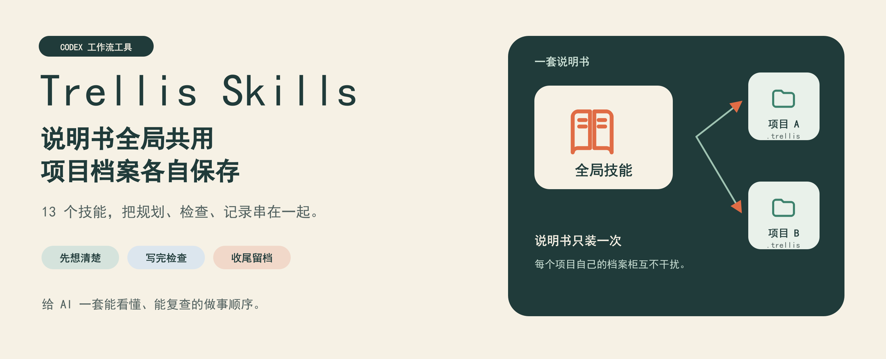
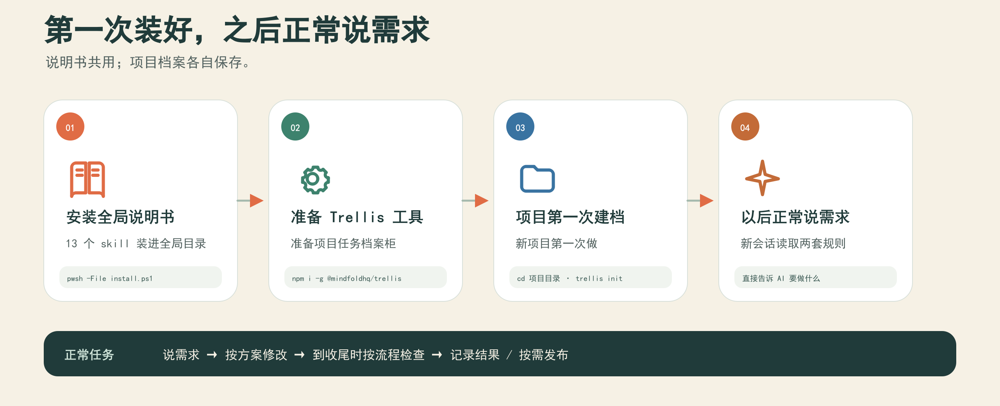

# Trellis Skills 汉化大白话版（13 个 Codex 技能包）

这是一套给 **Codex（以及兼容 Codex skill 规范的 AI 编程工具）** 用的技能包。它让 AI 按项目流程做事：先确认需求、再修改代码、检查结果，最后留下任务记录。**1.4.0 新增自动更新：每次开始或继续 Trellis 任务，顺便检查 GitHub；有新版就在后台下载，当前任务收尾后自动安装。** 全局技能和空闲的已登记项目一起更新；其他正在工作的项目，等它们各自收尾再补齐。

<p align="center">
  
</p>

<p align="center"><strong>一套说明书，多个项目各自留档。</strong></p>

## 一张图看懂怎么用

<p align="center">
  
</p>

## 这是干什么用的

简单说：**这是给 AI 立规矩的。**

平时你让 AI 改代码，它想怎么干就怎么干，改完直接扔给你。装了这套技能包之后，它会按固定流程干活：

| 序号 | 流程 | 大白话解释 |
|---|---|---|
| 1 | 开任务前先写方案 | 先把"要做什么、怎么验证"写清楚，你确认了才动手 |
| 2 | 写代码前先查规范 | 先看项目已有的规矩和代码习惯，不瞎写 |
| 3 | 做完任务后继续检查和收尾 | 正常流程完成代码修改和已授权提交后，AI 自动进入收尾，等待全量检查结果；不过关先修复，不归档、不算完成 |
| 4 | 发版说明必须写大白话 | GitHub Release 说明必须让不懂编程的人也看得懂 |
| 5 | 检查通过后自动存档 | 进入正常收尾流程后，检查通过才会把任务记录和改动说明存进项目档案 |

## 有什么用

| 序号 | 好处 |
|---|---|
| 1 | AI 不会想到哪改到哪，每个任务都有方案、有检查、有记录 |
| 2 | 代码改完自动过质量检查，改坏了能当场发现 |
| 3 | 发版说明不再是"feat: xxx"这种黑话，你和用户都能看懂这次更新了什么 |
| 4 | 每个任务的方案、改动、测试结果都留在项目里，隔几个月也能查 |
| 5 | 技能装一次全局生效，所有项目都能用，不用每个项目单独装 |

## 包含哪 13 个技能

| 序号 | 技能名 | 干什么用 |
|---|---|---|
| 1 | trellis-start | 开新任务：帮你把需求整理成任务文档 |
| 2 | trellis-brainstorm | 想方案：需求不清楚时，先帮你把思路理清楚 |
| 3 | trellis-before-dev | 写码前准备：动手前先查项目规范和现有代码 |
| 4 | trellis-check | 质量检查：改完代码做全面检查（含"发版说明和 README 必须大白话"检查） |
| 5 | trellis-update-spec | 更新规范：把这次学到的东西写进项目规范 |
| 6 | trellis-continue | 继续任务：接着上次的任务继续干 |
| 7 | trellis-finish-work | 收尾：先跑全量检查，检查通过再存档和记录（含"发版说明大白话"规则） |
| 8 | trellis-break-loop | 跳出死循环：AI 反复改不好时换思路 |
| 9 | trellis-channel | 多模型协作：多个 AI 工具之间传话 |
| 10 | trellis-meta | 元信息：查看和管理这套流程本身 |
| 11 | trellis-session-insight | 会话记录：查看以前干过什么 |
| 12 | trellis-spec-bootstrap | 规范起步：新项目第一次生成项目规范 |
| 13 | trellis-setup | 一键初始化：检查环境、装档案柜，新项目第一次用先喊它 |

## 怎么下载

### 方法一：用 git 下载（推荐）

打开命令行，输入：

```bash
git clone https://github.com/ssqaq/trellis-skills.git
```

### 方法二：下载压缩包

1. 打开本仓库页面
2. 点绿色的 **Code** 按钮
3. 点 **Download ZIP**
4. 解压到任意文件夹

## 怎么安装（Windows）

### 方法一：一键安装（推荐）

下载仓库后，在仓库文件夹里打开命令行，跑一条命令：

```powershell
pwsh -File install.ps1
```

需要已安装 PowerShell 7、Python 3.10 或更高版本，以及 Trellis 主程序；可分别用 `pwsh --version`、`python --version`、`trellis --version` 查看。主程序安装方法见下面第 2 步。

安装脚本会完成以下操作：

1. 安装 13 个全局技能；如果旧全局目录 `.codex/skills` 里已有 Trellis，也一起更新。
2. 在用户的 `.codex/AGENTS.md` 里增加一小段只针对 Trellis 项目的入口规则，保留原来的用户说明。
3. 更新已登记空闲项目里的技能和流程说明；忙碌项目保留当前规则，登记为待更新，等自己的任务收尾后补齐。
4. 修改说明文件前，把原件备份到用户目录的 `.trellis-skills/backups/`。不改业务源码，不清空任务、规范和日志。
5. 保存实际安装版本并接好自动更新。更新失败时恢复本次替换的文件；文件如果被其他任务同时修改，会保留那份修改并明确报错。
6. 检查 Trellis 主程序是否已安装。只升级这套技能包，不自动升级主程序。

装好后新开 Codex 会话，让它加载新版全局说明；已经打开的会话需要重新读取更新后的项目规则。

### 方法二：手动安装

### 第 1 步：把技能复制到全局目录

把下载下来的 `skills` 文件夹里的 **13 个 trellis 开头的文件夹**，全部复制到：

```text
C:\Users\你的用户名\.agents\skills\
```

如果这个文件夹不存在，自己建一个就行。复制完长这样：

```text
C:\Users\你的用户名\.agents\skills\
├── trellis-before-dev\
├── trellis-brainstorm\
├── trellis-break-loop\
├── trellis-channel\
├── trellis-check\
├── trellis-continue\
├── trellis-finish-work\
├── trellis-meta\
├── trellis-session-insight\
├── trellis-spec-bootstrap\
├── trellis-setup\
├── trellis-start\
└── trellis-update-spec\
```

复制后，新开的 Codex 会话可以识别这些技能。**只复制文件不会安装全局入口规则或升级旧项目流程；要获得本页描述的完整自动收尾和统一升级功能，请运行上面的一键安装脚本。**

### 第 2 步：安装 Trellis 主程序

这套技能需要一个叫 Trellis 的工具配合（技能是"说明书"，Trellis 是"档案柜"）。在命令行输入：

```bash
npm install -g @mindfoldhq/trellis
```

装完验证一下：

```bash
trellis --version
```

能显示版本号就说明装好了。

### 第 3 步：给你的项目建档案柜（每个项目只做一次）

进入你的项目文件夹，跟 AI 说一句"初始化 Trellis"（会自动触发 trellis-setup 技能），或者自己跑一次初始化：

```bash
cd 你的项目文件夹
trellis init
```

跑完后项目里会多一个 `.trellis` 文件夹，这就是这个项目自己的档案柜（任务记录、项目规范都存这里）。**每个项目只需要跑一次，以后不用再跑。**

### 第 4 步：登记项目里的技能副本（每个项目根目录只做一次）

旧项目登记一次项目根目录，让以后升级时连技能和收尾规则一起更新。只使用全局技能、没有项目技能副本的项目也能登记：

```powershell
pwsh -File sync-local-skills.ps1 -ProjectRoot "D:\你的项目文件夹"
```

它会查找这个目录和子项目里的 Trellis 安装，更新空闲项目的技能和收尾说明，并记住项目目录。忙碌项目暂缓，依赖目录和目录链接跳过。完成一次新版安装后，正常开始或继续任务就会检查更新，不用每次专门发送升级命令。

用新版“初始化 Trellis”技能时会自动完成登记。如果自己手动运行 `trellis init`，新版全局入口会在后续正常开发会话中补接流程；也可以直接运行上面的登记命令，立即确认完成。项目自定义规则会保留，说明文件的原件有备份。

## 怎么使用

安装完成后，你不需要输入任何特殊命令。**正常跟 AI 说话就行**，技能会自动被触发：

| 序号 | 你说什么 | 会发生什么 |
|---|---|---|
| 1 | "帮我加一个登录功能" | AI 会先用 trellis-start 帮你建任务、写方案，你确认后才动手 |
| 2 | （正常任务的代码修改、检查和已授权提交完成后） | AI 自动继续进入 trellis-finish-work，等待全量检查，通过后归档和记录；不需要你再发一次“收尾” |
| 3 | "这次改动发到 GitHub 上" | 按已有发布授权推送，并核对涉及的 README/Release 说明是否是大白话；单纯推送不会另外强制重跑质量检查 |
| 4 | "收尾吧" | 先跑全量质量检查；检查通过后才存档任务、记录这次改动 |
| 5 | "初始化 Trellis" | 自动触发 trellis-setup，检查环境并给项目建档案柜 |
| 6 | 正常开始或继续 Trellis 任务 | 后台检查新版，有新版先下载，当前任务收尾后安装；已登记项目自动跟进 |

### 想手动指定用某个技能也可以

在对话里用 `$技能名` 的写法：

```text
$trellis-check 帮我检查一下刚才的改动
```

```text
$trellis-brainstorm 我想给软件加个导出功能，帮我理理思路
```

## 三个要点（必读）

| 序号 | 要点 | 说明 |
|---|---|---|
| 1 | 技能是全局的，档案柜是每个项目一份 | 技能（说明书）装一次所有项目共用；`.trellis` 文件夹（档案柜）每个项目自己一个，互不干扰。所以每个新项目第一次用之前，记得跑一次 `trellis init` |
| 2 | 自动收尾依靠 Codex 执行项目规则 | 正常任务准备完成时，主会话会继续进入收尾检查；任务中途问进度、暂停、停止或关闭软件不会启动这一步。这是 AI 工作流程，不是能在应用关闭后继续运行的后台服务 |
| 3 | 技能和旧项目流程一起升级 | 登记一次项目目录。以后任务开始或继续时检查新版，收尾后更新全局和空闲项目；忙碌或离线项目会记录下来，后续自动补齐 |

## 卸载方法

### 方法一：一键卸载（推荐）

在仓库文件夹里跑一条命令：

```powershell
pwsh -File uninstall.ps1
```

它会先停用自动更新，再删除 `.agents/skills` 和旧 `.codex/skills` 中属于本包的13个 Trellis 技能，并移除全局入口段落。项目技能、任务档案、升级备份和其他用户说明保留，不会因为后台下载完成又自动装回来。

### 方法二：手动卸载

建议使用上面的一键卸载，同时清理全局入口。手动删除技能时，还需移除用户 `.codex/AGENTS.md` 中标记为 `TRELLIS-SKILLS:GLOBAL-AUTOFINISH` 的段落；不要删除其他说明。项目里的 `.trellis` 存着任务档案，卸载技能无需删除它。

## 常见问题

| 序号 | 问题 | 答案 |
|---|---|---|
| 1 | 装完技能，AI 说找不到 | 技能列表是会话开始时加载的。**关掉当前 Codex 会话，重新开一个**，新会话就能识别了 |
| 2 | `trellis init` 报"命令不存在" | 先装主程序：`npm install -g @mindfoldhq/trellis`，装完跑 `trellis --version` 验证，再回去 init |
| 3 | 新项目第一次用，要不要再装一遍技能 | 不用。技能是全局的，装一次就行。新项目只需要跑一次 `trellis init` 建档案柜（或直接说"初始化 Trellis"） |
| 4 | 没建 Trellis 任务，AI 直接改了几行代码，质量检查会跑吗 | 完整自动收尾针对正常 Trellis 任务。绕过流程的零散修改不能算已检查；需要检查时可以直接说“检查这次改动”。正常任务做完不需要再补发“收尾吧” |
| 5 | 会话变成 idle 或 completed，会自动跑全量检查吗 | 不会。那只是会话状态变化，不等于 Trellis 收尾流程。要保证检查，必须进入 `finish-work`；它会先检查，检查通过后才归档 |
| 6 | 在跟 Trellis 无关的项目里，技能被误触发了 | 直接跟 AI 说"这个项目不用 Trellis"即可。或者用一键卸载删掉全局技能，只在需要的项目里保留 |
| 7 | 升级后旧项目要不要重新 init | 不要。新版安装器会保留任务、规范、日志和业务代码，只更新技能及自动收尾说明，并备份旧说明 |
| 8 | macOS / Linux 能用吗 | 技能文件本身通用，可手动复制。本文的一键安装和真实新会话复测针对 Windows；其他系统的安装过程没有在本版实测，不声称开箱即用 |
| 9 | GitHub 发新版后，还需要我发升级命令吗 | 安装过1.4.0后不需要。每次开始或继续 Trellis 任务会检查，有新版先下载，任务收尾后安装；没有任务运行时不会一直检查 |
| 10 | 已经检查通过，为什么还有检查 | 开发中的专项测试不等于收尾全量检查。同一次收尾里，只剩归档和记日志时不会因这些记录变化反复检查；代码或检查条件改过才重新检查 |
| 11 | 推送 GitHub 前会额外强制检查吗 | 不会只因为你说“推送”就额外跑一次。质量检查仍属于正常开发和收尾流程 |
| 12 | 其他项目还在工作怎么办 | 那个项目继续用原来的技能和规则，等它自己的任务收尾后补更新，不会假装已经全部同步 |
| 13 | GitHub 连不上，或者下载失败怎么办 | 当前任务继续用现有版本；更新失败会说明原因，下次开始或继续任务时再检查 |
| 14 | 收尾时新版还没下载完怎么办 | 最多再等15秒；仍未完成就保留，后续在新任务开始前或收尾时自动处理 |

## 怎么升级（老用户看这里）

**1.3.4及更早的版本，需要先升级这一次，才能获得自动更新功能。**

| 序号 | 步骤 | 操作 |
|---|---|---|
| 1 | 下载最新版 | 重新 git clone 或下载 ZIP（或在自己克隆的文件夹里跑 git pull） |
| 2 | 安装这一次 | 在仓库文件夹里跑 `pwsh -File install.ps1`，更新全局和空闲项目，忙碌项目登记待更新 |
| 3 | 开始使用 | 不需要重新 `trellis init`。新开会话加载入口规则，以后正常开始或继续任务即可自动检查更新 |

自动更新只下载本仓库最新的正式 Release，不跟随未发布的代码，也不安装预发布版。多个会话同时触发时会合并正在进行的检查，并互斥安装。下载包必须通过完整性校验才会安装；安装原件、保留版本和待更新项目记录都留在用户配置目录中。

想看每版改了什么，去仓库根目录的 [CHANGELOG.md](CHANGELOG.md)（更新记录）。

维护者发布新版时，请遵守[自动更新所需的发布包约定](docs/maintaining-updates.md)。

本次已通过50项自动化检查及两个真实 Codex 新任务复测，详见[1.4.0验证记录](docs/verification-1.4.0.md)。

## 怎么查自己装的是哪个版本

| 序号 | 方法 |
|---|---|
| 1 | 看安装输出中的 `Installed version: x.x.x`，以及是否还有待更新项目 |
| 2 | 直接让 Codex“查看 Trellis 已安装版本和待更新项目”，它会读取实际安装记录；下载目录里的版本不等于已经安装的版本 |

## 版本说明

| 序号 | 内容 |
|---|---|
| 1 | 基于 Trellis 0.7.0-beta.3 的 13 个技能 |
| 2 | 新增：GitHub Release 发版说明和 README 必须写大白话的规则（在 trellis-check 和 trellis-finish-work 两个技能里） |
| 3 | 新增：一键安装脚本 install.ps1 |
| 4 | 新增：trellis-setup 总管技能，一句"初始化 Trellis"完成环境检查和项目初始化 |
| 5 | 修复：进入 `finish-work` 收尾时，第一步强制重新跑全量质量检查；检查失败不归档、不记录完成、不发布 |
| 6 | 说明说清楚：会话单纯变成 idle/completed 不会自动触发检查，必须进入正常收尾流程 |
| 7 | 新增项目技能自动同步：项目根目录登记一次，之后每次运行新版安装脚本都会更新该项目已有的 Trellis 技能 |
| 8 | 1.3.4 接通正常任务的自动收尾，升级旧项目规则并备份，新增真实新会话验证 |
| 9 | 1.4.0 开始或继续任务时后台检查新版，收尾后安装，其他忙碌项目延后同步；增加版本记录、下载校验和安装恢复 |
